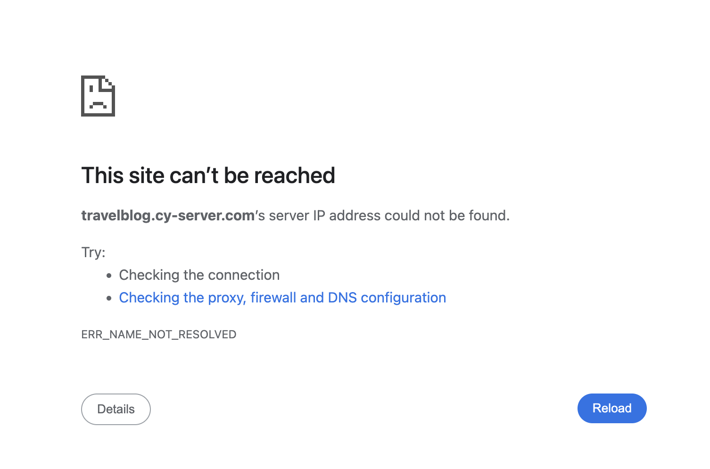

# 电脑的Chrome和Safari经常连不上我的网站

***2026-07-19***

---

## 目标
- 保持随时稳定连接
- 找出原因

---

## 症状
- Safari卡在连接界面
  
  
- Chrome显示先是卡在界面，然后弹出`ERR_NAME_NOT_RESOLVED`
  

## 正常访问网站流程
```
Chrome
   │
   │ ① DNS 查询
   ▼
DNS Server
   │
   │ 返回 IP
   ▼
你的电脑
   │
   │ ② TCP 三次握手
   ▼
OCI VPS (80/443)
   │
   │ ③ TLS 握手
   ▼
Nginx Proxy Manager
   │
   │ ④ HTTP GET /
   ▼
Flask
   │
   │ 返回 HTML
   ▼
浏览器
```

## 技术栈
- Wireshark v4.4.6

### 1.排查DNS是不是出问题
进入网卡 `Wi-Fi: en0` 后用chrome打开网站，之后停止抓包。查看HTTP Query是否发送，然后是否Response。
请求：
```
dns.qry.name contains "travelblog.cy-server.com"
```
可以看到：
```
AAAA travelblog.cy-server.com
A    travelblog.cy-server.com
HTTPS travelblog.cy-server.com
```
A代表查询IPv4地址
AAAA代表查询IPv4地址
HTTPS是DNS HTTPS Resource Record (SVCB/HTTPS)，注意不是HTTPS TCP443流量。

#### 异常点：
查看 `A    travelblog.cy-server.com` 的L3 Packet时发现了家里路由器IP地址。考虑到我之前对路由器设置过maqDNS用于解析cy-server.com的内部服务，而我mac又开启了tailscale，可能所有的cy-server.com流量加密回家，而不是走网站服务器。

错误流量：
```
Mac
↓

192.168.50.1

↓

dnsmasq

↓

192.168.XXX.XXX
```

验证：
```
dig travelblog.cy-server.com @192.168.50.1

dig travelblog.cy-server.com @1.1.1.1

dig travelblog.cy-server.com @8.8.8.8
```


