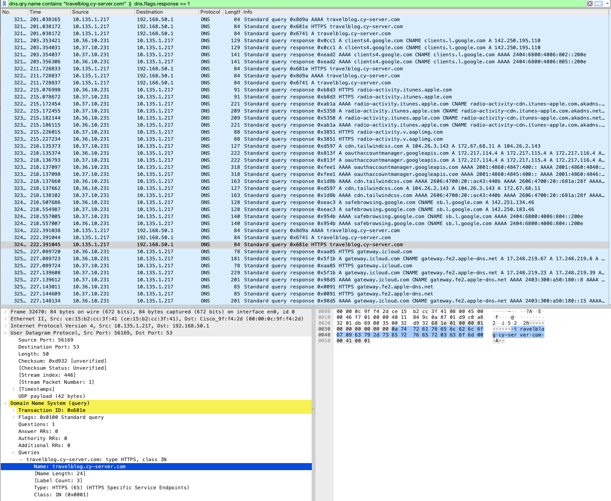

# Safari经常连不上我的网站

***2026-07-19***

---

## 目标
- 保持随时稳定连接
- 找出原因

---

## 症状
- Safari卡在连接界面
  
  
- Chrome显示先是卡在界面，然后弹出`ERR_NAME_NOT_RESOLVED`
  

## 正常访问网站流程
```
Chrome
   │
   │ ① DNS 查询
   ▼
DNS Server
   │
   │ 返回 IP
   ▼
你的电脑
   │
   │ ② TCP 三次握手
   ▼
OCI VPS (80/443)
   │
   │ ③ TLS 握手
   ▼
Nginx Proxy Manager
   │
   │ ④ HTTP GET /
   ▼
Flask
   │
   │ 返回 HTML
   ▼
浏览器
```

## 技术栈
- Wireshark v4.4.6

### 1.排查DNS是不是出问题
进入网卡 `Wi-Fi: en0` 后用chrome打开网站，之后停止抓包。查看HTTP Query是否发送，然后是否Response。
请求：
```
dns.qry.name contains "travelblog.cy-server.com"
```
可以看到：
```
AAAA travelblog.cy-server.com
A    travelblog.cy-server.com
HTTPS travelblog.cy-server.com
```
A代表查询IPv4地址

AAAA代表查询IPv4地址

HTTPS是DNS HTTPS Resource Record (SVCB/HTTPS)，注意不是HTTPS TCP443流量

#### 异常点1：

查看 `A    travelblog.cy-server.com` 的L3 Packet时发现了家里路由器IP地址。考虑到我之前对路由器设置过maqDNS用于解析cy-server.com的内部服务，而我mac又开启了tailscale，可能所有的cy-server.com流量加密回家，而不是走网站服务器。

错误流量：
```
Mac
↓

192.168.50.1

↓

dnsmasq

↓

192.168.XXX.XXX
```

验证：
```
dig travelblog.cy-server.com @192.168.50.1

dig travelblog.cy-server.com @1.1.1.1

dig travelblog.cy-server.com @8.8.8.8
```
结果：
1. 查询家里路由器 DNS：失败，符合Wireshark中显示只有query，没有response的结果
2. 查询 Cloudflare DNS：正常（返回的不是服务器公网IP因为CF开了橙云）
3. 查询查询 Google DNS：也正常（返回的不是服务器公网IP因为CF开了橙云）

### 2. 查看Mac实际用了哪些DNS

```
scutil --dns | grep -E 'resolver|nameserver|domain|if_index'

networksetup -getdnsservers Wi-Fi（看看WiFi有没有专门DNS）

dig travelblog.cy-server.com
```

#### 异常点2 dig 居然完全不能工作
```
;; connection timed out; no servers could be reached
```
Mac 连配置的 DNS Server 都联系不上。

#### 异常点3 DNS根本没工作
无论是Tailscale的Magic DNS还是UWA DNS理论上都应该能解析道travelblog公网ip，但是全部超时。很有可能Tailscale已经掉线导致的。

#### 修复
- 关闭Mac Tailscale后 `dig dig travelblog.cy-server.com` 和网站能正常打开。一打开就dig失败并且网页刷新不出来。
- 但是发现了更大的问题，我搭建的Tailscale貌似挂了，记忆里是两天（7月17号）前手机探针失联开始，一开始没当一会儿事儿，可能那个时候Tailscale就出现了问题。未来需要排查修复。


