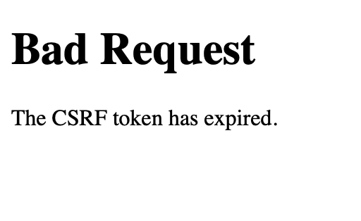
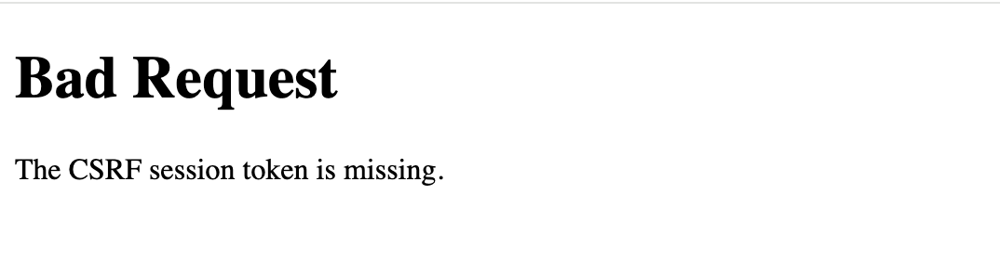

# 长时间填写无法保存草稿

**2026-07-21**

## 问题
1. 长时间填写Submit form出现CSRF Token Expire.
2. CSRF Token过期后的提示词是Bad Request The CSRF token has expired.



CSFR_Expire

## 目标：
1. 提示词改成用户友好版本
2. 每个用户增加草稿功能，最多存24小时，最多存3篇

---
## 过程

### 1. 修改Tocken过期提示词
```
CSRF 校验失败
    ↓
Flask-WTF 抛出 CSRFError
    ↓
handle_csrf_error(error) (在_init_.py里面改)
    ↓
写入 flash 提示（在base.html）
    ↓
跳回来源页面
```

1. 修改init和base.html
2. 本地进入网站，然后在Post界面删除当前Session Cookie然后Post
3. 失败了，依然没有触发用户友好提示词，明天再修
